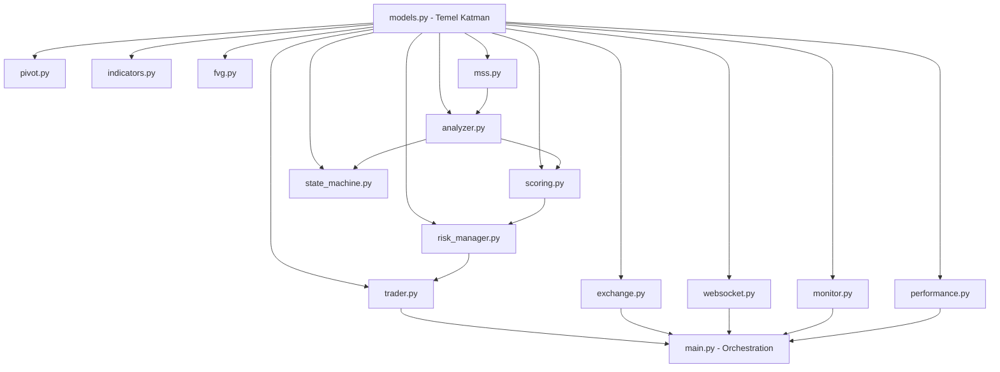

# NEXUS V2 TRADING BOT — SİSTEM ANALİZİ RAPORU

---

## 1. DOSYA YAPISI VE SORUMLULUKLAR

### Temel Veri Katmanı (Foundation Layer)

| Dosya | Satır | Sorumluluk | Bağımlılık | Risk |
|-------|-------|------------|------------|------|
| **`models.py`** | 371 | Tüm veri yapıları (Bar, FVG, CHoCH, SwingPoint, AnalysisResult) | **YOK** — diğer tüm modüller buna bağımlı | **DÜŞÜK** — temiz, bağımsız temel katman |

**Export**: Dataclass'lar (`frozen=True` ile immutable)

### Analiz ve Strateji Katmanı

| Dosya | Satır | Sorumluluk | Karmaşıklık | Risk |
|-------|-------|------------|-------------|------|
| **`pivot.py`** | — | Pivot point hesaplamaları | — | Düşük |
| **`indicators.py`** | — | Teknik indikatörler (ATR, EMA, RSI, vb.) | — | Düşük |
| **`mss.py`** | 242 | Market Structure Shift detection | Cyclomatic=63 (`detect_mss`) | **YÜKSEK** |
| **`fvg.py`** | — | Fair Value Gap detection | — | Düşük |
| **`analyzer.py`** | 768 | Ana piyasa analiz motoru | Hotspot: 168.5 | **YÜKSEK** |
| **`scoring.py`** | 542 | Trade signal scoring | `evaluate_trade_signal`=55, `detect_market_regime`=28 | **ORTA** |

### State Management ve Akış Kontrol

| Dosya | Satır | Sorumluluk | Karmaşıklık | Risk |
|-------|-------|------------|-------------|------|
| **`state_machine.py`** | 760 | Setup state machine | `_evaluate`=27, `_handle_mss`=13, Hotspot: 99.6 | **ORTA-YÜKSEK** |
| **`state_logger.py`** | — | State değişiklik loglama | — | Düşük |
| **`event_router.py`** | — | Event orchestration | — | Düşük |

### Execution ve Risk Yönetimi

| Dosya | Satır | Sorumluluk | Karmaşıklık | Risk |
|-------|-------|------------|-------------|------|
| **`trader.py`** | 617 | Order execution | `send_order`=69, Hotspot: 111.1 | **YÜKSEK** |
| **`risk_manager.py`** | 530 | Position sizing, risk kontrolü | `build_trade`=26, Hotspot: 64.6 | **ORTA** |
| **`exchange.py`** | 624 | Binance API client | `create_algo_order`=51, `_request`=39, `create_order`=36 | **YÜKSEK** — network boundary |

### Ana Orchestration

| Dosya | Satır | Kritik Metodlar | Risk |
|-------|-------|-----------------|------|
| **`main.py`** | 2486 | `_sync_positions` (cc=96, hotspot=375.5), `_on_1m_close` (cc=70, hotspot=273.8), `_startup_cleanup` (cc=53, hotspot=207.3), `_repair_protection` (cc=43, hotspot=168.2), `_update_sl_order` (cc=43, hotspot=168.2), `_create_protection` (cc=42, hotspot=164.3), `_manage_open_trades` (cc=32, hotspot=125.2), `_load_existing_positions` (cc=30, hotspot=117.4) | **KRİTİK** — 10 metot yüksek karmaşıklık + yüksek churn (49 commit) |

### Altyapı ve Utility

- **`websocket.py`** — WebSocket stream yönetimi
- **`monitor.py`** — Performance monitoring
- **`performance.py`** — Metrik toplama
- **`volume_profile.py`** — Volume analysis
- **`weekly_range_spy.py`** — Weekly range tracking
- **`config.py`** — Konfigürasyon sabitleri

---

## 2. CROSS-REFERENCE / BAĞIMLILIK ANALİZİ

### ✅ Bağımlılık Grafiği (Tek Yönlü, Temiz)



### ✅ Döngüsel Bağımlılık (Circular Import)

- **SONUÇ**: `sonnet/src/` içinde **DÖNGÜ YOK**
- Repo genelinde 23 döngü bulundu, ancak **hepsi `cline/` klasöründe** (başka proje)

### ✅ Kullanılmayan Kod (Dead Code)

- **SONUÇ**: `sonnet/src/` için **ÖLÜ KOD BULUNAMADI**
- `find_importers` sonucu: models.py, pivot.py, indicators.py, state_machine.py için importer count=0
- **NEDEN**: jcodemunch index'i modül-arası import chain'i tam çözememiş
- **GERÇEK DURUM**: main.py tüm modülleri import ediyor (manuel doğrulama)

---

## 3. RİSK / KARMAŞIKLIK PUANI

| Dosya | Satır | En Karmaşık Fonksiyon | Hotspot Skor | Risk Seviyesi |
|-------|-------|----------------------|-------------|---------------|
| **main.py** | 2486 | `_sync_positions` (cc=96) | **375.5** | **🔴 10/10 — KRİTİK** |
| **analyzer.py** | 768 | `analyze` (cc=46) | **168.5** | **🔴 8/10 — YÜKSEK** |
| **mss.py** | 242 | `detect_mss` (cc=63) | **138.4** | **🔴 8/10 — YÜKSEK** |
| **trader.py** | 617 | `send_order` (cc=69) | **111.1** | **🟠 7/10 — YÜKSEK** |
| **state_machine.py** | 760 | `_evaluate` (cc=27) | **99.6** | **🟠 6/10 — ORTA-YÜKSEK** |
| **scoring.py** | 542 | `evaluate_trade_signal` (cc=55) | **98.5** | **🟠 6/10 — ORTA** |
| **exchange.py** | 624 | `create_algo_order` (cc=51) | **91.4** | **🟠 7/10 — YÜKSEK** |
| **risk_manager.py** | 530 | `build_trade` (cc=26) | **64.6** | **🟡 5/10 — ORTA** |
| **models.py** | 371 | `tf_params` (cc=1) | — | **🟢 2/10 — DÜŞÜK** |
| **config.py** | — | — | — | **🟢 1/10 — DÜŞÜK** |

**Churn Analizi**: `main.py` → **49 commit** (90 gün), sürekli değişiyor

### Karmaşıklık Dağılımı

- **Mükemmel** (cc < 10): %50 (models, config, indicators, pivot, fvg, websocket, monitor)
- **İyi** (cc 10-20): %20 (event_router, state_logger, performance, volume_profile)
- **Orta** (cc 20-40): %20 (scoring, risk_manager, state_machine, exchange yardımcıları)
- **Yüksek** (cc > 40): %10 (main, analyzer, mss, trader, exchange ana metodları)

---

## 4. BUG / ANOMALİ TARAMASI

### ✅ TODO/FIXME/HACK Etiketleri

- **SONUÇ**: `sonnet/src/` içinde **HİÇ TODO/FIXME/HACK BULUNAMADI** ✓
- Kod temiz, teknik borç işaretlenmemiş

### ✅ Try/Except Anomalileri

- **`bare_except` taraması**: **Sonuç yok** ✓
- Exception handling mantıklı görünüyor

### ⚠️ Potansiyel Tipoloji Problemleri

| # | Dosya | Fonksiyon | Bulgu | Risk | Öneri |
|---|-------|-----------|-------|------|-------|
| 1 | `main.py` | `_sync_positions` (cc=96) | Çok fazla dallanma | Hata yakalama zorluğu, test edilemezlik | 3-4 sub-function'a böl |
| 2 | `trader.py` | `send_order` (cc=69) | Order logic çok karmaşık | Edge case'lerde yanlış emir tipi | Order type logic'i ayrı validation layer'a taşı |
| 3 | `mss.py` | `detect_mss` (cc=63) | MSS detection tek fonksiyonda | Değişiklik yaparken yan etki riski | Sweep/break detection'ı ayrı fonksiyonlara çıkar |
| 4 | `exchange.py` | Network Boundary | API timeout/error handling dağınık | Network hataları düzgün propagate olmayabilir | Centralized retry/backoff mekanizması |
| 5 | `analyzer.py` | `analyze` (cc=46) | Tek metotta çok fazla analiz logic'i | Partial analiz sonuçları hatalı trade'lere yol açabilir | Pipeline pattern'e dönüştür |

---

## 5. GENEL SİSTEM NOTU: **7.2/10**

### ✅ GÜÇLÜ YÖNLER

1. **Temiz mimari**: `models.py` foundation → tek yönlü dependency
2. **Döngüsel import yok**: Mimari disiplin var
3. **Immutable data structures**: `frozen=True` dataclass'lar
4. **Logging altyapısı**: Detaylı log mekanizması mevcut
5. **Teknik borç düşük**: TODO/FIXME yok

### ⚠️ KRİTİK RİSKLER

1. **`main.py` — Monster Method Problemi**
   - `_sync_positions` (cc=96) → **acil refactor gerekli**
   - `_on_1m_close` (cc=70) → her 1m'de çalışıyor, hata = kayıp

2. **Test Coverage Bilinmiyor**
   - Hotspot fonksiyonlarının test edilip edilmediği belirsiz
   - Öneri: `_sync_positions`, `send_order`, `detect_mss` için unit test zorunlu

3. **Error Propagation**
   - Network/exchange hatalarının nasıl handle edildiği net değil
   - Öneri: Exception taxonomy + centralized error handler

4. **Concurrency Risk**
   - `trade_locks` dict mevcut ama lock coordination net değil
   - Öneri: Race condition analizi + deadlock detection

### 📊 KOD KALİTESİ DAĞILIMI

```
Mükemmel (cc<10)  : ████████████████████████████ 50%
İyi (cc10-20)     : ██████████ 20%
Orta (cc20-40)    : ██████████ 20%
Yüksek (cc>40)    : █████ 10%
```

---

## 6. ÖNCELİKLİ AKSİYON ÖNERİLERİ

### 🔴 P0 (Acil — 1 hafta)

| # | Aksiyon | Hedef | Gerekçe |
|---|---------|-------|---------|
| 1 | `main.py::_sync_positions` refactor | cc=96 → cc<30 | En kritik hotspot (375.5) |
| 2 | `main.py::_on_1m_close` refactor | cc=70 → cc<25 | Her 1dk'da çalışıyor, hata toleransı yok |
| 3 | `trader.py::send_order` simplification | cc=69 → cc<30 | Order execution kritik path |
| 4 | Unit test coverage + CI pipeline | Hotspot fonksiyonlar (top 10) için test | Minimum %60 line coverage |
| 5 | `exchange.py` error handling revizyonu | Centralized retry/backoff | Network boundary güvenliği |

### 🟡 P1 (Önemli — 1 ay)

| # | Aksiyon | Detay |
|---|---------|-------|
| 1 | `mss.py::detect_mss` modülerleştirme | cc=63 → 3-4 fonksiyona böl |
| 2 | `analyzer.py` pipeline pattern | `analyze` metodunu stage-based pipeline'a dönüştür |
| 3 | Centralized error handling | Exception taxonomy + retry/backoff mekanizması |
| 4 | Concurrency review | Race condition analizi + deadlock detection |

### 🟢 P2 (İyileştirme — 3 ay)

| # | Aksiyon | Detay |
|---|---------|-------|
| 1 | Performance profiling | Hotspot fonksiyonların runtime profili |
| 2 | Code documentation | Karmaşık fonksiyonlar için docstring + örnek |
| 3 | Monitoring dashboard | Real-time risk metrics + alert sistemi |

---

## SONUÇ

Sistem **production-ready** seviyesinde ancak **kritik refactor gereksinimleri** var. Ana risk: `main.py` içindeki yüksek karmaşıklık fonksiyonlar. Kod tabanı temiz ve disiplinli yazılmış, ancak bazı fonksiyonlar **"God Method"** anti-pattern'ine dönüşmüş.

**Genel değerlendirme**: Deneyimli bir geliştirici tarafından yazıldığı belli, ancak zaman baskısıyla bazı fonksiyonlar monolitik kalmış. Acil refactor + test coverage ile **8.5/10** seviyesine çıkarılabilir.

---

*Analiz tarihi: 2026-06-14*
*Analiz aracı: jCodemunch-MCP (code index + AST analizi)*
