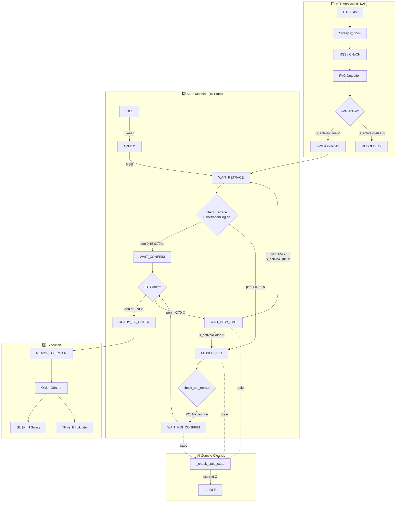

# NEXUS V3 — İşleme Giriş Mimarisi

## Özet

| Aşama | Açıklama |
|-------|----------|
| **1️⃣ HTF** | H1 birincil, 2H fallback. `is_active=False` olan FVG reddedilir |
| **2️⃣ State Machine** | 10 state: IDLE → ARMED → WAIT_RETRACE → WAIT_CONFIRM / MISSED_FVG → READY_TO_ENTER |
| **🔁 Döngü** | pen > 0.70 (FVG delinmiş) → WAIT_NEW_FVG → yeni FVG beklenir |
| **❌ Zombi** | WAIT_NEW_FVG, MISSED_FVG, WAIT_POI_CONFIRM expire olursa IDLE |
| **3️⃣ Execution** | READY_TO_ENTER → order → 4H swing SL + 1H likidite TP |
